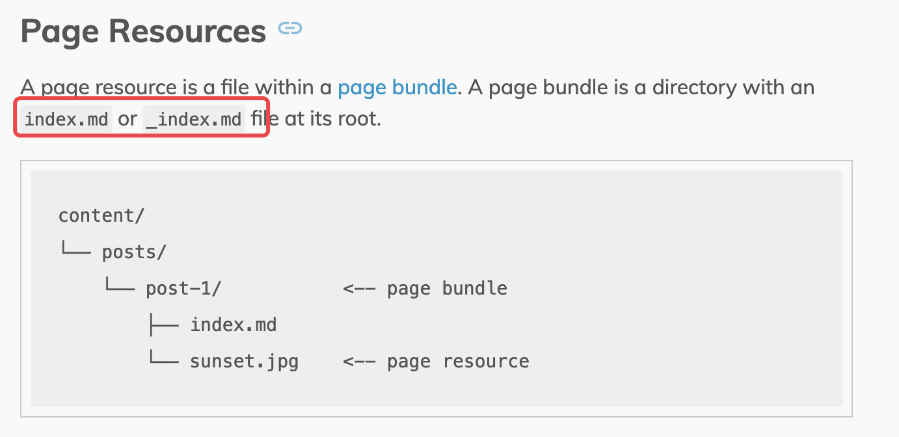

#[Hugo 主题 LoveIt](/images/Apple-Devices-Preview.png "Hugo 主题 LoveIt")
Hugo - **LoveIt** 使用.
<!--more-->

<style>
h3,h1 {
background : lightgray;
}

h3:hover {
color : red;
}

</style>

### <class h3>1.clone主题并更新配置</class>
```
 1.git clone LoveIt到themes/目录
 2.修改config.tom配置,将LoveIt/sample的config.tom cp到base目录
 3.修改config.tom配置,去掉en对应的配置-否则需要中英文各写一篇

 vim themes/LoveIt/exampleSite/content/posts/theme-documentation-basics/index.zh-cn.md
```

### 2.官方文档
> 打开将LoveIt/sample页面: hugo server --source=exampleSite
> 依据官方文档配置
<a href=https://hugoloveit.com/zh-cn/theme-documentation-basics/#32-%E7%BD%91%E7%AB%99%E5%9B%BE%E6%A0%87-%E6%B5%8F%E8%A7%88%E5%99%A8%E9%85%8D%E7%BD%AE-%E7%BD%91%E7%AB%99%E6%B8%85%E5%8D%95>官方链接</a>

### 3.其他tips
```
hugo serve --disableFastRender   --buildDrafts   -e production
draft开启,product可以开启comment等

社交链接参考: 图标等放在static下
可以自定义 browserconfig.xml 和 site.webmanifest 文件来设置 theme-color 和 background-color. static下
```

### 4.自定义样式
```
在 assets/css/_override.scss 中, 你可以覆盖 themes/LoveIt/assets/css/_variables.scss 中的变量以自定义样式.
```

### 5.搜索
```
    todo
```

---

> <span style="color:red"> content </span>
### 6.内容组织
> 标签:  - {\{< admonition note "本地资源引用" >}}  {\{< /admonition >}} 

> 文档:  vim  themes/LoveIt/exampleSite/content/posts/theme-documentation-content/index.zh-cn.md




有三种方法来引用**图片**和**音乐**等本地资源:

1. 使用[页面包](https://gohugo.io/content-management/page-bundles/)中的[页面资源](https://gohugo.io/content-management/page-resources/).
   你可以使用适用于 `Resources.GetMatch` 的值或者直接使用相对于当前页面目录的文件路径来引用页面资源.
2. 将本地资源放在 **assets** 目录中, 默认路径是 `/assets`.
   引用资源的文件路径是相对于 assets 目录的.
3. 将本地资源放在 **static** 目录中, 默认路径是 `/static`.
   引用资源的文件路径是相对于 static 目录的.

引用的**优先级**符合以上的顺序.

在这个主题中的很多地方可以使用上面的本地资源引用,
例如 **链接**, **图片**, `image` shortcode, `music` shortcode 和**前置参数**中的部分参数.

页面资源或者 **assets** 目录中的[图片处理](https://gohugo.io/content-management/image-processing/)会在未来的版本中得到支持.
非常酷的功能! :(far fa-grin-squint fa-fw):


### 7.前置参数
[官方参考](https://hugoloveit.com/zh-cn/theme-documentation-content/#front-matter)

### 8.摘要,默认提取,可手动设置
> - \<!--more-->

---


### 9.markdown语法扩展

---

### 10.emoji

:smile:

---

### 11.公式

### 12.***shortcut***
[shortcut官方](https://hugoloveit.com/zh-cn/theme-documentation-extended-shortcodes/#11-script)
> 也可以style加入css控制
<ol>
<li style="color:blue; ">style </li>
<li style="color:blue; ">link </li>
<li style="color:blue; ">image </li>
<li style="color:blue; ">admonition </li>
<li style="color:blue; ">mermaid </li>
<li style="color:blue; ">echarts </li>
<li style="color:blue; ">bilibili... mapbox</li>
</ol>

---

### 13.hugo获取资源,比如imag

`必须index开头的md才能获取当前目录的文件,否则应该放在全局 /asserts/images/下; 不过前置参数resource.name .image方式不能获取`
> posts下一个目录:如果有index.md只能有一个生效,父dir也不行 todo
`页面资源仅仅可由页面包可以访问， 页面包就是一个根部包含index.md, 或者 _index.md文件的目录。资源仅仅与它们所属的最低层级的页面绑定。对于不包含index.md 的目录不附属任何资源。` [参考](https://www.andbible.com/post/hugo-content-management-page-resources/)
```
.
├── db
│   ├── index2.md --->如果是index,则当前目录及子目录只能渲染一个html
│   ├── libc.jpg
│   └── sqlite
│       ├── libc.jpg
│       ├── sqite2
│       │   └── index.md  ---> index.md理论上只应该放在最低层目录,且只有一个md
│       ├── x.md
│       └── xx.md
├── loveit
│   ├── featured-image.jpg
│   ├── hugo_image_res.png
│   └── index.md 
└── tpl.md

```

### 14.comment
```
    1.https://valine.js.org/quickstart.html 注册，然后F.； 会生成appid，key
    2.修改 vi themes/next/_config.yml ； 修改valine 开启true，把key加上
    3.最后！记得在Leancloud -> 设置 -> 安全中心 -> Web 安全域名 把你的域名加进去
```
### 15.seo
```
google:
    https://search.google.com/search-console/sitemaps?resource_id=https%3A%2F%2Ffeng1o.github.io%2F 将一个html放在static下,然后加入sitemap.xml

baidu:
    
```
### 16.todo
```
    a.搜索
    b.
```


